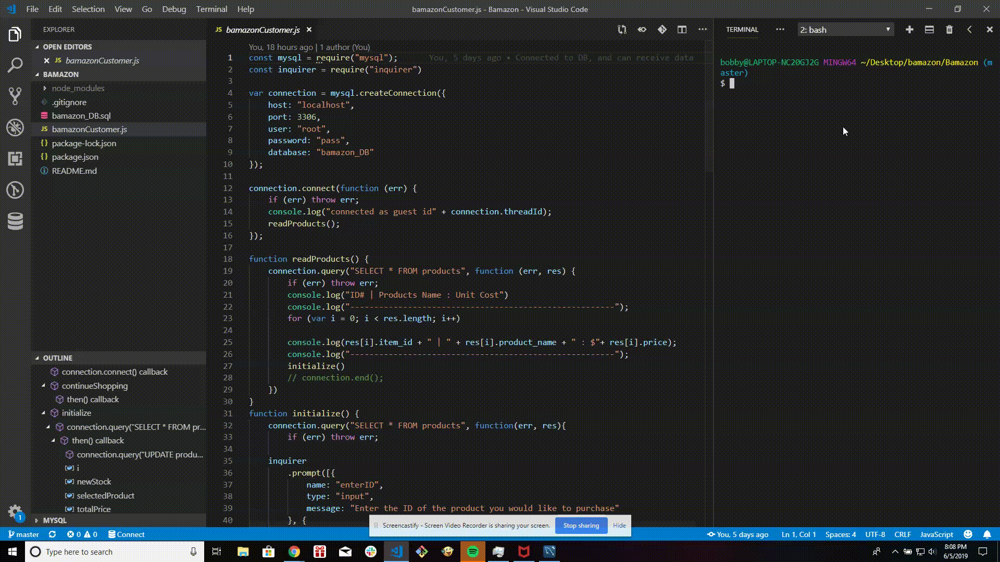

# Bamazon

>Link to Github repo https://lov3tt.github.io/Bamazon/

>Bamazon app

The Bamazon app is an application that simulate an online shopping site.

>Feature

1) Access data for the stock inventory through mysql.

2) Update the remaining stocks, base on what've been purchase.

3) Give the total price of the products once order.

4) Allow the user to choose which products they wish to purcahse.

By Bobby Quach
